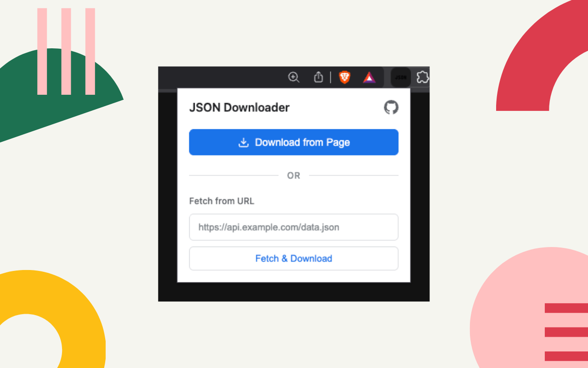

  

  # JSON Downloader Chrome Extension
  
  A minimal, developer-first Chrome extension that allows you to download JSON data from web pages or URLs with a single click. Features a modern UI with automatic JSON detection and a floating download button.
  
   
  
  

## Features

- **Automatic JSON Detection**: Floating download button appears automatically on pages with JSON content
- **Download from Page**: Extract and download JSON from the current page with one click
- **Fetch from URL**: Paste any public JSON URL to fetch and download the response
- **JSON Validation**: Automatically validates JSON before downloading
- **Smart Filenames**: Files saved as `json-download_<hostname>_<timestamp>.json`
- **Modern UI**: Clean, intuitive popup design
- **Privacy-First**: No tracking, no anaľ̌̌̌̌̌̌̌̌̌̌ytics, no data collection

## Installation

### From Chrome Web Store

### Manual Installation (Developer Mode)
1. Download or clone this repository
2. Open Chrome and navigate to `chrome://extensions`
3. Enable "Developer mode" (toggle in top-right)
4. Click "Load unpacked" and select the extension directory
5. The JSON Downloader icon will appear in your toolbar

## Usage

### Method 1: Floating Button (Automatic)
1. Visit any page displaying JSON (e.g., API endpoints)
2. A blue "Download JSON" button will appear in the top-right
3. Click to download instantly

### Method 2: Extension Popup
1. Click the JSON Downloader icon in your toolbar
2. Option A: Click "Download from Page" to get JSON from current tab
3. Option B: Paste a JSON URL and click "Fetch & Download"

## Privacy

- No tracking or analytics
- No ads or dark patterns
- No data collection or transmission
- Minimal permissions requested
- Open source - verify the code yourself

See [PRIVACY.md](PRIVACY.md) for full privacy policy.

## Permissions

This extension requests the following permissions:

- **activeTab**: Access the current tab to extract JSON when you click the download button
- **scripting**: Execute content script to detect JSON on pages
- **downloads**: Save JSON files to your computer using Chrome's download API
- **host_permissions (<all_urls>)**: Detect JSON on any website and fetch from URLs you provide

All permissions are used solely for the extension's core functionality. No data leaves your device.

## How It Works

1. **Content Script**: Runs on web pages to detect JSON and inject the download button
2. **Service Worker**: Handles JSON formatting and download operations
3. **Popup Interface**: Provides manual control for downloading JSON

All processing happens locally in your browser. No external servers are involved.

## Technical Details

- Built with **Manifest V3** (latest Chrome extension standard)
- No remote code execution
- All actions are user-initiated
- Respects CORS and same-origin policies
- Uses modern Chrome APIs

## Contributing

Contributions are welcome! Please feel free to submit issues or pull requests.

See [CONTRIBUTING.md](CONTRIBUTING.md) for guidelines.

## License

MIT License - See [LICENSE](LICENSE) file for details.

## Links

- [GitHub Repository](https://github.com/chethanyadav456/JSON-Downloader)
- [Report a Bug](https://github.com/chethanyadav456/JSON-Downloader/issues)
- [Privacy Policy](PRIVACY.md)
- [Security Policy](SECURITY.md)

## Contact

For questions or feedback, please open an issue on GitHub.
